
<h1 align="center">中国陕西民俗网</h1>

## 简介
中国陕西民俗网：角色分为管理员、普通用户；展示陕西民俗文化、商品管理、用户管理、订单管理、在线互动和信息查询；支持用户登录注册及商品购买、评论分享，旨在推广和传承陕西文化遗产。    --计算机毕业设计源码；毕设源码；java毕业设计源码

## 联系方式

<h3 align="center">获取完整代码与数据库文件 + 微信：deepguan QQ: 86050149 QQ群: 783742310</h3>

<h3 align="center">可帮忙远程部署 包运行成功！提供远程部署、修改代码、设计文档指导、代码讲解等服务！</h3>

## 功能介绍（完整见运行截图）
管理员：基本功能包括登录、注册和退出，能够通过主导航栏访问不同模块，管理商品信息，查看订单详情，执行添加、删除和编辑操作，进行公告管理、民俗介绍管理和用户管理等。支持商品搜索、查看商品详情，处理购物车结算，查看和管理用户的订单信息，包括查询订单、查看详细信息。个人中心提供管理员账户信息的查看与修改功能，有助于监控和管理整体网站运营，确保系统的正常运行和内容及时更新。

用户：用户可以进行注册、登录和退出操作，通过首页主导航栏访问民俗文化介绍、公告信息、旅游景点等功能模块。可浏览和搜索商品信息，查看详细商品介绍并加入购物车，进行订单结算和在线支付（模拟）。个人中心提供用户个人信息管理，包括查看和编辑个人信息、收货地址管理、订单查询以及商品收藏管理。用户能够浏览丰富的民俗文化资料，并参与评论和互动，增强体验和交流感受。

## 运行截图
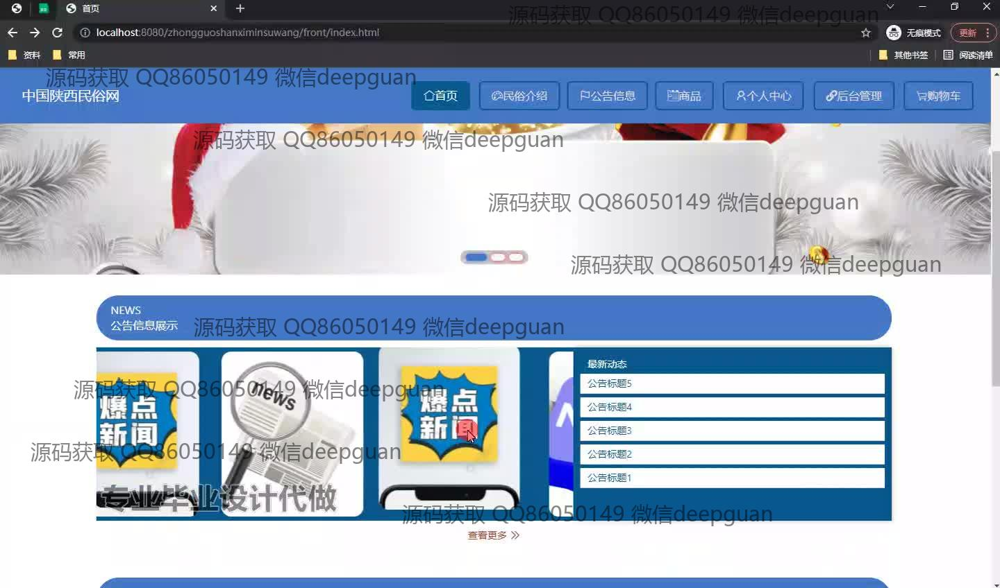
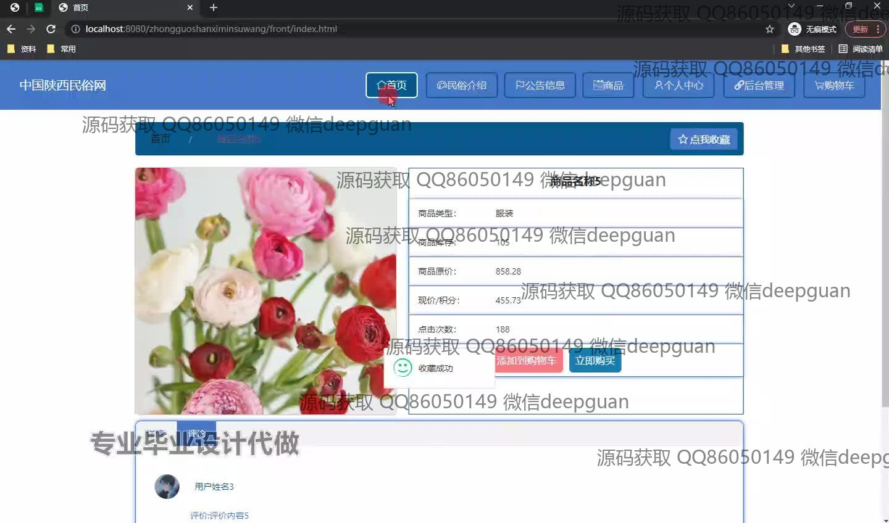
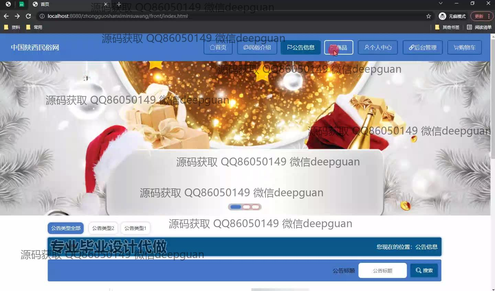
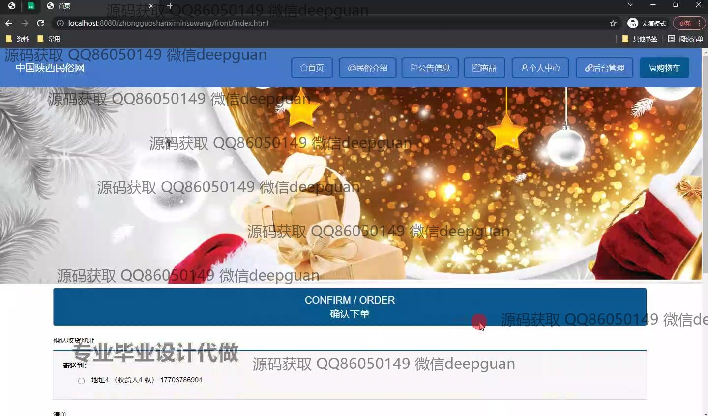
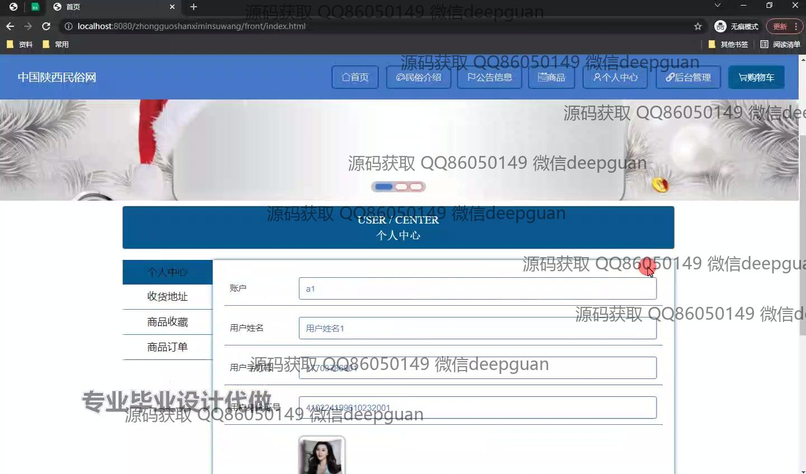
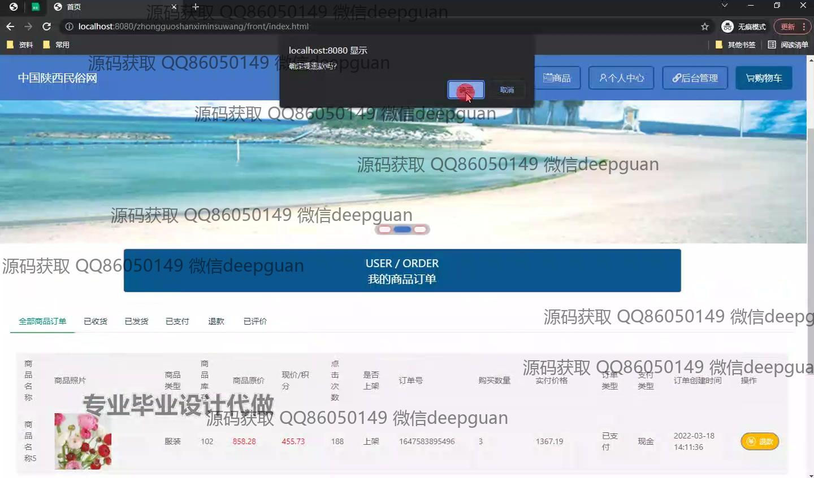
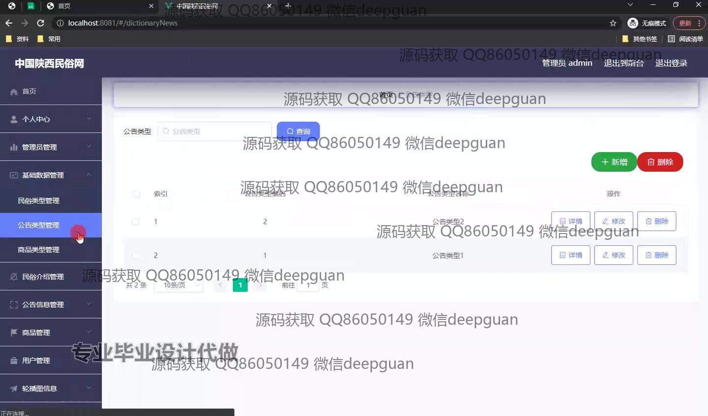
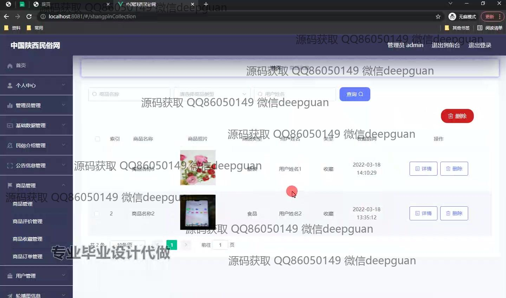
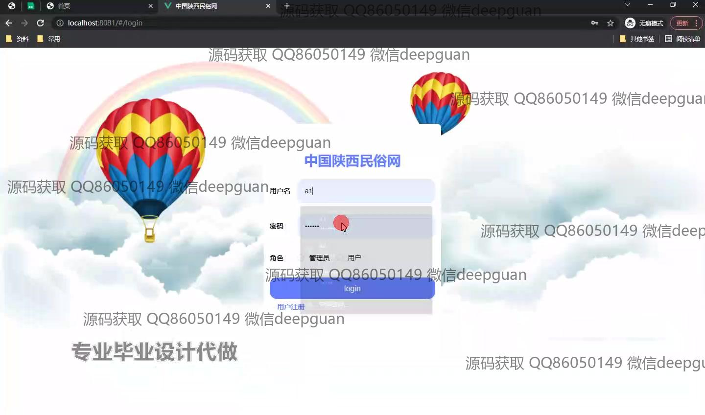
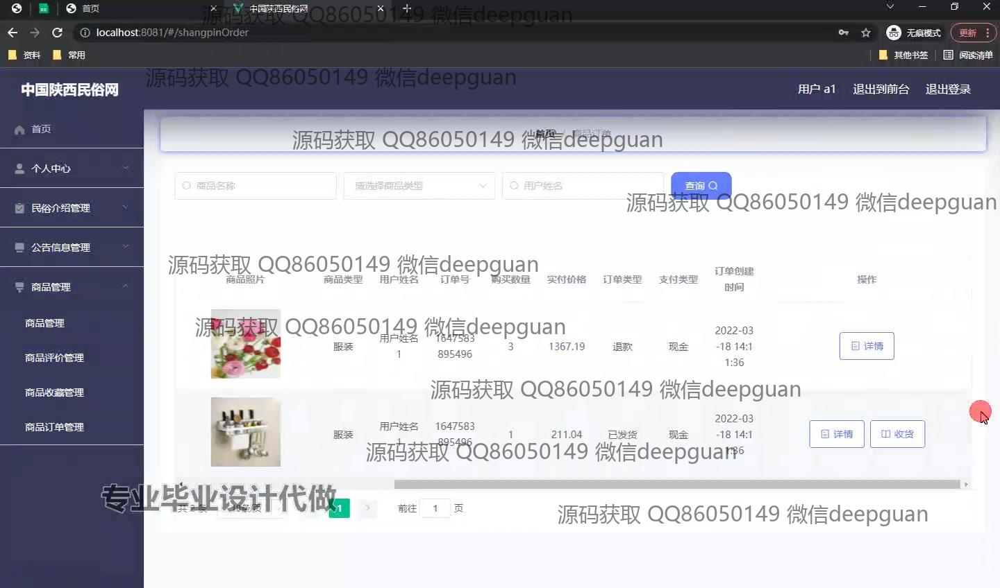
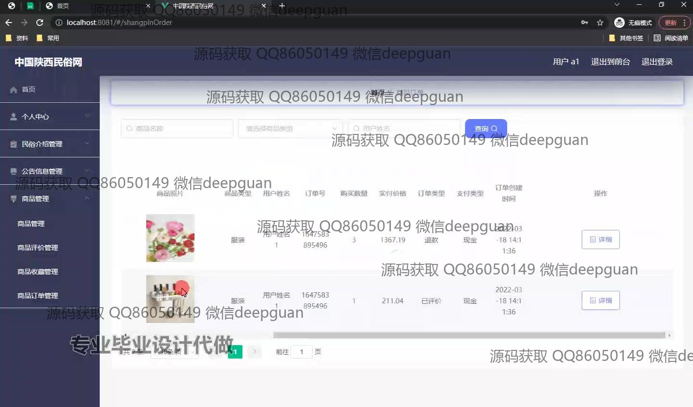
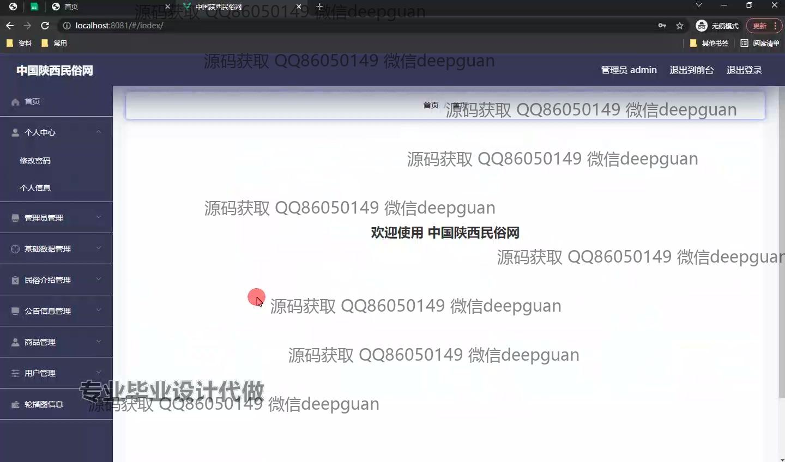

本代码来源于网络,仅供学习参考使用!

